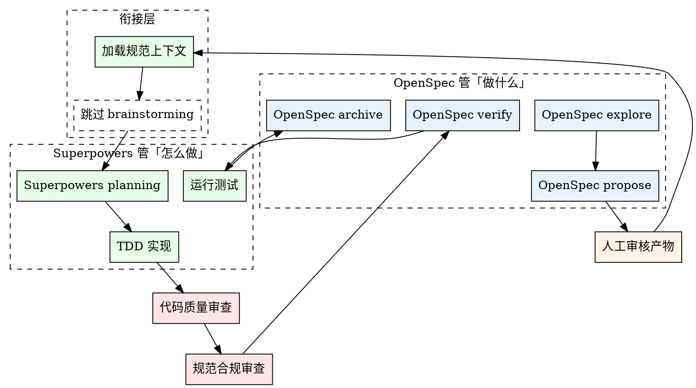

# OpenSpec-Superpowers 衔接规范

## 铁律

实现任何 OpenSpec task 之前，必须先加载对应的规范文档。没有规范上下文的实现就是盲写代码。

## 执行步骤

### 1. 加载规范上下文

```bash
openspec list --json
```

确定当前活跃的变更目录。

**如果不确定当前变更目录**：
- 运行 `ls openspec/changes/` 查看未归档的变更文件夹
- 如果只有一个，那就是当前变更
- 如果有多个，询问用户确认

**必须读取的文件**：
- `openspec/specs/` 下的主规范（了解已有约束）
- `openspec/changes/<name>/proposal.md`（变更范围）
- `openspec/changes/<name>/design.md`（技术方案）
- `openspec/changes/<name>/specs/` 下的增量规范
- `openspec/changes/<name>/tasks.md`（任务列表）

### 2. 跳过重复阶段

**如果 OpenSpec 的 explore 和 propose 已经完成**：
- ✅ 跳过 Superpowers 的 brainstorming 阶段
- ✅ 直接进入 planning 阶段
- ✅ 把 proposal.md 和 design.md 作为 brainstorming 的等效输出

**原因**：OpenSpec 的 explore 已经讨论过需求和技术方案，Superpowers 的 brainstorming 会重复劳动。

### 3. 转换粒度

把 OpenSpec 的 tasks 转换成 Superpowers 的 TDD 步骤：

| OpenSpec Task | Superpowers Plan |
|---------------|------------------|
| "实现 JWT 签发函数" | 1. 写失败测试 → 2. 运行测试 → 3. 写最小实现 → 4. 运行测试 → 5. 重构 → 6. 提交 |

**转换规则**：
- 每个 task 拆成 TDD 循环
- 场景直接转换为测试用例
- 保持每个 commit 粒度小

### 4. 场景到测试的转换规则

OpenSpec 的"假设/当/则"场景映射为测试用例：

```
OpenSpec 场景:
### 场景：有效凭证登录
- 假设 用户持有有效的用户名和密码
- 当 用户提交登录请求
- 则 返回 access token 和 refresh token

转换为测试:
test("有效凭证登录_返回token", () => {
  // 假设 -> setup
  const user = createTestUser({ username: "test", password: "valid" });
  
  // 当 -> action
  const result = await login({ username: "test", password: "valid" });
  
  // 则 -> assertion
  expect(result.access_token).toBeDefined();
  expect(result.refresh_token).toBeDefined();
});
```

**每个场景至少需要**：
1. 正常路径测试
2. 错误路径测试
3. 边界值测试（如适用）

### 5. 执行实现

每个 task 的执行流程：

```
┌─────────────────────────────────────────────────────┐
│                   执行单个 Task                       │
├─────────────────────────────────────────────────────┤
│                                                     │
│  1. 读取 task 描述和相关规范                          │
│           │                                         │
│           ▼                                         │
│  2. 调用 test-driven-development skill              │
│           │                                         │
│           ▼                                         │
│  3. RED: 写失败测试                                  │
│           │                                         │
│           ▼                                         │
│  4. GREEN: 最小实现                                  │
│           │                                         │
│           ▼                                         │
│  5. REFACTOR: 清理代码                              │
│           │                                         │
│           ▼                                         │
│  6. 调用 spec-compliance-check skill                │
│           │                                         │
│           ▼                                         │
│  7. 标记 task 完成: `- [ ]` → `- [x]`              │
│                                                     │
└─────────────────────────────────────────────────────┘
```

### 6. 双重审查

每次代码审查必须包含两个维度：

| 维度 | 使用 Skill | 检查内容 |
|------|-----------|----------|
| 代码质量 | `requesting-code-review` | 命名、结构、错误处理 |
| 规范合规 | `spec-compliance-check` | 需求覆盖、场景实现、决策遵循 |

### 7. 双重验证

全部任务完成后：

1. **OpenSpec verify**：`/opsx:verify`
   - 检查规范合规
   - 检查任务完成度
   - 检查设计一致性

2. **Superpowers verification**：`verification-before-completion`
   - 运行测试命令
   - 确认测试通过
   - 用证据支撑断言

### 8. 归档

**两个验证都通过后才能归档**：

```bash
/opsx:archive
```

## 流程图



## 检查清单

开始实现前确认：

- [ ] 已读取 `openspec/specs/` 主规范
- [ ] 已读取当前变更的 `proposal.md`
- [ ] 已读取当前变更的 `design.md`
- [ ] 已读取当前变更的 `specs/` 增量规范
- [ ] 已读取当前变更的 `tasks.md`
- [ ] 确认是否跳过 brainstorming（explore/propose 已完成）
- [ ] 准备好将场景转换为测试用例

## 常见问题

| 问题 | 解决方案 |
|------|----------|
| "AI 没读 design.md 就实现了" | 检查衔接 Skill 是否触发，手动加载规范 |
| "tasks 粒度太粗" | 自动拆成 TDD 步骤 |
| "verify 通过了但测试没跑" | archive 前强制跑测试 |
| "brainstorming 重复 explore" | 跳过 brainstorming 阶段 |
| "审查不检查规范合规" | 使用 spec-compliance-check skill |

## 与其他 Skill 的关系

| Skill | 关系 |
|-------|------|
| `openspec-explore` | 前置 - 确定做什么 |
| `openspec-new-change` | 前置 - 创建变更 |
| `writing-plans` | 衔接后调用 - 拆分实现计划 |
| `test-driven-development` | 实现时调用 - TDD 循环 |
| `spec-compliance-check` | 审查时调用 - 规范合规 |
| `verification-before-completion` | 归档前调用 - 运行测试 |

## 护栏

- 必须在实现前加载规范上下文
- 跳过 brainstorming 仅当 explore/propose 已完成
- 双重审查都必须执行
- 双重验证都必须通过
- 不确定时询问用户
