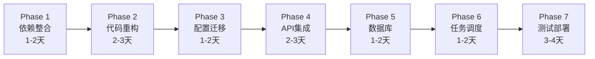

# GraphRAG 快速集成指南

## 快速概览

**当前状态**: GraphRAG 作为独立子模块，使用 Poetry 管理，独立服务运行
**目标状态**: 完全集成到 Alon 主工程，统一技术栈和部署
**预计工期**: 3-4 周

## 核心变更

### 1. 依赖管理
- **从**: Poetry
- **到**: uv (Alon 标准)
- **操作**: 将依赖添加到主 `pyproject.toml` 的 `[project.optional-dependencies]` 下新增 `graphrag` 组

### 2. Web 框架
- **从**: FastAPI 0.103.0 (独立服务)
- **到**: FastAPI 0.115.12 (集成到主应用)
- **操作**: 将 webserver 模块重构为 APIRouter

### 3. 配置管理
- **从**: `ragconfig/settings.yaml` + pyaml-env
- **到**: `config/application.yml` + Pydantic Settings
- **操作**: 定义 GraphRAGConfig 模型，集成到 Alon Settings

### 4. 存储后端
- **保持**: MinIO/File/Blob 支持
- **升级**: MinIO 7.2.7 → 7.2.15
- **增强**: 多租户路径隔离

### 5. 任务管理
- **从**: threading + 自定义 Task 类
- **到**: APScheduler + 数据库持久化
- **操作**: 集成到 Alon 任务调度系统

## 关键技术决策

| 问题 | 决策 | 原因 |
|------|------|------|
| 部署方式 | 集成到主应用 | 简化运维，统一管理 |
| LLM 调用 | 短期保留 OpenAI SDK | 降低迁移风险 |
| LLM 长期 | 适配 Agno 框架 | 统一成本监控 |
| 配置方式 | YAML + Pydantic | Alon 标准 |
| 任务调度 | APScheduler | Alon 标准 |
| 数据库 | 新增 GraphRAG 表 | 元数据持久化 |

## 实施路线图



## 最小化集成步骤

如果需要快速集成（1 周内），可以采用以下最小化方案：

### Day 1-2: 依赖和基础集成
```bash
# 1. 添加依赖到 pyproject.toml
[project.optional-dependencies]
graphrag = [
    "datashaper==0.0.49",
    "networkx>=3.0",
    # ... 其他核心依赖
]

# 2. 安装依赖
uv sync --extra graphrag

# 3. 验证导入
python -c "from graphrag.index import run_index; print('OK')"
```

### Day 3-4: API 集成
```python
# alon/components/graphrag/router.py
from fastapi import APIRouter
from alon.components.graphrag.webserver.main import app as graphrag_app

router = APIRouter(prefix="/api/graphrag", tags=["GraphRAG"])

# 将原有路由挂载
for route in graphrag_app.routes:
    router.add_route(route.path, route.endpoint, methods=route.methods)

# alon/application.py
from alon.components.graphrag.router import router as graphrag_router
app.include_router(graphrag_router)
```

### Day 5: 配置集成
```yaml
# config/application.yml
graphrag:
  storage:
    type: minio
    base_path: /ragdata
  llm:
    model: ${GRAPHRAG_LLM_MODEL:gpt-4-turbo-preview}
    api_key: ${GRAPHRAG_API_KEY}
```

### Day 6-7: 测试和部署
```bash
# 运行测试
uv run pytest tests/integration/graphrag/

# 启动服务
uv run python manage.py runserver
```

## 验证清单

### 功能验证
- [ ] 创建索引 API 正常工作
- [ ] 本地搜索返回正确结果
- [ ] 全局搜索返回正确结果
- [ ] Prompt 优化功能正常
- [ ] 任务状态查询正常
- [ ] 任务取消功能正常

### 集成验证
- [ ] 使用 Alon 认证中间件
- [ ] 多租户隔离生效
- [ ] 存储路径符合规范
- [ ] 日志正确输出到 Alon 日志系统
- [ ] 配置从 Alon Settings 正确加载

### 性能验证
- [ ] 索引速度符合预期
- [ ] 搜索响应时间 < 5s
- [ ] 内存使用正常
- [ ] 并发请求处理正常

## 常见问题

### Q1: 版本冲突如何处理？
A: 优先使用 Alon 版本，GraphRAG 依赖通常向后兼容。特别关注：
- pandas: 使用 2.3.0
- tiktoken: 使用 0.9.0
- minio: 使用 7.2.15

### Q2: 是否需要立即迁移 LLM 调用？
A: 不需要。短期保留 OpenAI SDK，长期再适配 Agno。

### Q3: 现有索引数据如何迁移？
A: 提供迁移脚本，或保持路径兼容性，逐步迁移。

### Q4: 性能是否会受影响？
A: 异步执行+独立线程池，影响很小。如有问题可回退到独立部署。

## 下一步

1. 阅读完整的 [GraphRAG 迁移指南](./graphrag_migration_guide.md)
2. 评估团队资源和时间表
3. 选择集成方案（完整集成 vs 最小化集成）
4. 开始 Phase 1: 依赖整合

## 联系支持

遇到问题可参考：
- 完整迁移指南: `docs/graphrag_migration_guide.md`
- GraphRAG 源码: `alon/components/graphrag/`
- Alon 配置示例: `config/application.yml`
