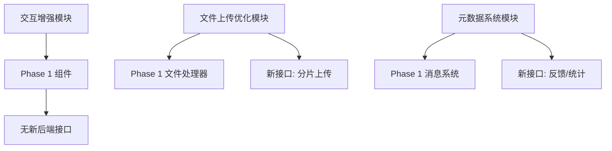

# Phase 2：AI SDK 高级功能与体验优化设计规格

> **版本**：1.0
> **日期**：2026-07-05
> **状态**：待实现
> **前置条件**：Phase 1 已完成

---

## 一、项目概述

### 1.1 背景

Phase 1 已实现 AI SDK 扩展的基础功能（来源引用、文件附件、自定义数据），Phase 2 旨在提升用户体验和增强可观测性。

### 1.2 目标

**核心目标**：
- 提升用户交互体验（交互优化）
- 支持大文件可靠上传（文件上传优化）
- 建立反馈与统计系统（元数据系统）

**非目标**：
- ❌ 动态工具支持（Phase 3 或后续版本）
- ❌ 性能优化（缓存策略、懒加载等）

### 1.3 范围

| 模块 | 功能 | 工期 |
|------|------|------|
| 交互增强 | 来源预览、文件预览器、数据交互、步骤进度 | 0.5 周 |
| 文件上传优化 | 分片上传、断点续传 | 0.5 周 |
| 元数据系统 | 用户反馈、使用统计 | 0.5 周 |

**总工期**：约 1.5 周（可并行开发）

---

## 二、架构设计

### 2.1 整体架构

```
┌─────────────────────────────────────────────────────────┐
│                    前端层（Vue 3）                        │
├─────────────────────────────────────────────────────────┤
│  交互增强模块      │  文件上传优化模块    │  元数据系统模块  │
│  - SourceRenderer │  - useChunkedUpload  │  - MessageFeedback│
│  - FilePreview    │  - UploadProgress    │  - UsageStats     │
│  - DataViz交互    │  - ChunkUploader     │  - MetadataStore  │
│  - StepIndicator  │                      │                   │
└─────────────────────────────────────────────────────────┘
                              ↓ API 调用
┌─────────────────────────────────────────────────────────┐
│                    后端层（FastAPI）                      │
├─────────────────────────────────────────────────────────┤
│  文件上传模块            │  元数据模块                     │
│  - 分片上传接口          │  - 反馈接口                     │
│  - 断点续传接口          │  - 统计接口                     │
│  - 上传状态存储 │  - 元数据存储        │
└─────────────────────────────────────────────────────────┘
                              ↓ 数据存储
┌─────────────────────────────────────────────────────────┐
│                    存储层                                 │
├─────────────────────────────────────────────────────────┤
│  MinIO（文件）    │  Redis（上传状态）  │  PostgreSQL（元数据）│
└─────────────────────────────────────────────────────────┘
```

### 2.2 模块依赖



### 2.3 技术选型

| 技术层 | 选择 | 说明 |
|--------|------|------|
| PDF 预览 | `pdfjs-dist` | Mozilla PDF.js 的 Vue 封装 |
| 图片预览 | 自定义组件 | 基于 CSS transform |
| Office 文档 | Google Docs Viewer | 免费在线预览服务 |
| 文件分片 | `spark-md5` | 计算文件 MD5 标识 |
| 元数据存储 | PostgreSQL JSONB | 灵活扩展，支持索引 |

---

## 三、模块一：交互增强

### 3.1 来源引用交互

**功能点**：
- 点击跳转到新标签页
- 记录点击行为
- Hover 显示预览摘要

**实现方式**：
- 前端增强 `SourceRenderer.vue` 组件
- 添加预览按钮和点击事件
- 通过事件总线记录行为（发送到元数据模块）

**关键代码**：

```vue
<template>
  <div class="source-card group" @click="handleClick">
    <GlobeIcon class="size-5" />
    <div class="flex-1">
      <div class="font-medium">{{ title }}</div>
      <div class="text-xs text-muted-foreground">{{ url }}</div>
    </div>
    <Button
      variant="ghost"
      size="sm"
      @click.stop="handlePreview"
      class="opacity-0 group-hover:opacity-100"
    >
      <EyeIcon class="size-4" />
    </Button>
  </div>
</template>

<script setup lang="ts">
const handleClick = () => {
  trackSourceClick(sourceId)
  window.open(url, '_blank')
}

const handlePreview = () => {
  showPreviewDialog(url)
}
</script>
```

### 3.2 文件预览增强

**功能点**：
- PDF 预览器
- 图片预览器（缩放、旋转）
- Office 文档预览

**实现方式**：
- 新增 `FilePreview.vue` 组件
- PDF 使用 `pdfjs-dist`
- 图片使用自定义组件
- Office 使用 Google Docs Viewer

**关键代码**：

```vue
<template>
  <Dialog v-model:open="isOpen">
    <DialogContent class="max-w-4xl max-h-[80vh]">
      <PdfViewer
        v-if="mediaType === 'application/pdf'"
        :url="url"
      />
      <ImageViewer
        v-else-if="mediaType.startsWith('image/')"
        :url="url"
        :zoom="true"
        :rotate="true"
      />
      <iframe
        v-else-if="isOfficeDocument"
        :src="getOfficeViewerUrl(url)"
        class="w-full h-[600px]"
      />
      <div v-else class="text-center py-8">
        <FileIcon class="size-12 mx-auto mb-4" />
        <p class="text-muted-foreground">该文件类型暂不支持预览</p>
        <Button @click="downloadFile" class="mt-4">
          <DownloadIcon class="size-4 mr-2" />
          下载文件
        </Button>
      </div>
    </DialogContent>
  </Dialog>
</template>
```

### 3.3 数据可视化交互

**功能点**：
- 表格排序（点击表头）
- 表格筛选（搜索框）
- JSON 语法高亮

**实现方式**：
- 增强 `TableRenderer.vue`
- 添加搜索框和排序逻辑
- 使用计算属性过滤数据

**关键代码**：

```vue
<template>
  <div class="overflow-x-auto rounded-lg border">
    <!-- 筛选栏 -->
    <div class="border-b px-4 py-2">
      <Input
        v-model="searchQuery"
        placeholder="搜索..."
        class="max-w-xs"
      />
    </div>

    <table class="w-full text-sm">
      <thead>
        <tr>
          <th
            v-for="header in headers"
            :key="header"
            class="cursor-pointer"
            @click="sortBy(header)"
          >
            {{ header }}
            <ChevronDownIcon
              v-if="sortColumn === header"
              :class="{ 'rotate-180': sortDirection === 'desc' }"
            />
          </th>
        </tr>
      </thead>
      <tbody>
        <tr v-for="row in filteredRows" :key="row">
          <td v-for="cell in row" :key="cell">{{ cell }}</td>
        </tr>
      </tbody>
    </table>
  </div>
</template>

<script setup lang="ts">
const filteredRows = computed(() => {
  let rows = props.content.rows

  if (searchQuery.value) {
    rows = rows.filter(row =>
      row.some(cell =>
        String(cell).toLowerCase().includes(searchQuery.value.toLowerCase())
      )
    )
  }

  if (sortColumn.value) {
    const colIndex = headers.indexOf(sortColumn.value)
    rows = [...rows].sort((a, b) => {
      return sortDirection.value === 'asc'
        ? a[colIndex] > b[colIndex] ? 1 : -1
        : a[colIndex] < b[colIndex] ? 1 : -1
    })
  }

  return rows
})
</script>
```

### 3.4 步骤进度展示

**功能点**：
- 显示多步骤任务进度
- 支持状态：pending、active、done
- 可折叠详情

**实现方式**：
- 新增 `StepIndicator.vue` 组件
- 使用图标和颜色编码状态

**关键代码**：

```vue
<template>
  <div class="space-y-2">
    <div v-for="(step, index) in steps" :key="index" class="flex items-start gap-3">
      <div
        class="w-8 h-8 rounded-full flex items-center justify-center"
        :class="{
          'bg-primary text-primary-foreground': step.status === 'active',
          'bg-green-500 text-white': step.status === 'done',
          'bg-muted text-muted-foreground': step.status === 'pending',
        }"
      >
        <CheckIcon v-if="step.status === 'done'" />
        <LoaderIcon v-else-if="step.status === 'active'" class="animate-spin" />
        <span v-else>{{ index + 1 }}</span>
      </div>
      <div class="flex-1">
        <div class="font-medium">{{ step.title }}</div>
        <div v-if="step.description" class="text-sm text-muted-foreground">
          {{ step.description }}
        </div>
      </div>
    </div>
  </div>
</template>

<script setup lang="ts">
interface Step {
  title: string
  description?: string
  status: 'pending' | 'active' | 'done'
}

defineProps<{ steps: Step[] }>()
</script>
```

---

## 四、模块二：文件上传优化

### 4.1 核心流程

```
┌─────────────┐
│  前端分片    │  1. 计算文件 MD5
│  Chunking   │  2. 切分为 5MB 分片
└──────┬──────┘  3. 并发上传（最多 3 个）
       │
       ▼
┌─────────────┐
│  后端接收    │  4. 存储到临时目录
│  Chunks     │  5. 记录进度到 Redis
└──────┬──────┘  6. 返回已接收列表
       │
       ▼
┌─────────────┐
│  合并分片    │  7. 合并所有分片
│  Merge      │  8. 上传到 MinIO
└──────┬──────┘  9. 清理临时文件
       │
       ▼
┌─────────────┐
│  清理状态    │  10. 删除 Redis 记录
│  Cleanup    │  11. 返回文件 URL
└─────────────┘
```

### 4.2 前端实现

**核心组合式函数**：`useChunkedUpload.ts`

**关键参数**：
- 分片大小：5 MB
- 并发数量：3 个分片
- MD5 计算：前 2 MB（提升性能）

**关键方法**：

```typescript
export function useChunkedUpload() {
  const CHUNK_SIZE = 5 * 1024 * 1024
  const MAX_CONCURRENT = 3

  /**
   * 计算文件 MD5（前 2MB）
   */
  const calculateMD5 = async (file: File): Promise<string> => {
    const spark = new SparkMD5.ArrayBuffer()
    const reader = new FileReader()
    const chunk = file.slice(0, 2 * 1024 * 1024)

    return new Promise((resolve) => {
      reader.onload = (e) => {
        spark.append(e.target?.result as ArrayBuffer)
        resolve(spark.end())
      }
      reader.readAsArrayBuffer(chunk)
    })
  }

  /**
   * 并发上传控制
   */
  const uploadWithConcurrency = async (file, chunks, fileId) => {
    const queue = [...chunks]
    const activeUploads: Promise<void>[] = []

    while (queue.length > 0 || activeUploads.length > 0) {
      while (activeUploads.length < MAX_CONCURRENT && queue.length > 0) {
        const chunk = queue.shift()!
        const promise = uploadChunk(file, chunk, fileId).then(() => {
          const index = activeUploads.indexOf(promise)
          if (index > -1) activeUploads.splice(index, 1)
        })
        activeUploads.push(promise)
      }

      if (activeUploads.length > 0) {
        await Promise.race(activeUploads)
      }
    }
  }

  /**
   * 主上传方法
   */
  const uploadFile = async (file: File) => {
    const fileId = await calculateMD5(file)

    // 检查断点续传
    const { data } = await client.get(`/upload-state/${fileId}`)
    uploadedChunks.value = new Set(data.uploadedChunks)

    // 创建并过滤分片
    const chunks = createChunks(file)
    const pendingChunks = chunks.filter(c => !uploadedChunks.value.has(c.index))

    // 并发上传
    await uploadWithConcurrency(file, pendingChunks, fileId)

    // 合并分片
    const { data: result } = await client.post('/merge-chunks', {
      fileId,
      filename: file.name,
      totalChunks: chunks.length,
    })

    return { url: result.url }
  }

  return { uploadFile, uploadProgress, uploadStatus }
}
```

### 4.3 后端接口

**接口 1：上传分片**

```
POST /ai/console/v1/files/upload-chunk

Request:
- file: 分片文件
- fileId: 文件唯一标识（MD5）
- chunkIndex: 分片索引
- totalChunks: 总分片数

Response:
{
  "code": 200,
  "msg": "分片上传成功",
  "data": {
    "chunkIndex": 0,
    "totalChunks": 10
  }
}
```

**接口 2：查询上传状态**

```
GET /ai/console/v1/files/upload-state/{fileId}

Response:
{
  "code": 200,
  "data": {
    "fileId": "abc123",
    "uploadedChunks": [0, 1, 2, 3]
  }
}
```

**接口 3：合并分片**

```
POST /ai/console/v1/files/merge-chunks

Request:
{
  "fileId": "abc123",
  "filename": "document.pdf",
  "totalChunks": 10
}

Response:
{
  "code": 200,
  "msg": "文件上传成功",
  "data": {
    "url": "https://minio.example.com/ai/files/abc123/document.pdf"
  }
}
```

### 4.4 Redis 数据结构

```
Key: upload:{fileId}
Type: SET
Value: {0, 1, 2, 3, ...}  # 已上传的分片索引
TTL: 86400  # 24 小时过期

示例：
upload:abc123 -> {0, 1, 2, 3, 5}
```

---

## 五、模块三：元数据系统

### 5.1 数据模型

**表结构**：`ai.message_metadata`

```sql
CREATE TABLE ai.message_metadata (
    id UUID PRIMARY KEY DEFAULT gen_random_uuid(),
    message_id VARCHAR(255) NOT NULL,
    tenant_id VARCHAR(64) NOT NULL,
    user_id VARCHAR(64) NOT NULL,

    -- 用户反馈
    rating SMALLINT,  -- 1: 👎, 2: 👍
    feedback TEXT,

    -- 使用统计
    prompt_tokens INTEGER,
    completion_tokens INTEGER,
    total_tokens INTEGER,
    model_name VARCHAR(255),
    provider VARCHAR(255),
    response_time_ms INTEGER,

    -- 时间戳
    created_at TIMESTAMP DEFAULT CURRENT_TIMESTAMP,
    updated_at TIMESTAMP DEFAULT CURRENT_TIMESTAMP,

    UNIQUE(message_id, tenant_id),
    INDEX idx_tenant_user (tenant_id, user_id),
    INDEX idx_created_at (created_at)
);
```

### 5.2 后端接口

**接口 1：提交反馈**

```
POST /ai/console/v1/metadata/feedback

Request:
{
  "message_id": "msg-123",
  "rating": 2,
  "feedback": "回答很有帮助"
}

Response:
{
  "code": 200,
  "msg": "反馈提交成功",
  "data": {
    "message_id": "msg-123",
    "rating": 2,
    "feedback": "回答很有帮助",
    "created_at": "2026-07-05T10:30:00Z"
  }
}
```

**接口 2：获取统计数据**

```
GET /ai/console/v1/metadata/usage-stats?start_date=2026-07-01&end_date=2026-07-31

Response:
{
  "code": 200,
  "data": {
    "total_messages": 1250,
    "total_tokens": 537500,
    "total_cost": 2.69,
    "avg_response_time_ms": 1850,
    "rating_distribution": {
      "1": 50,
      "2": 1200
    },
    "model_distribution": {
      "gpt-4o": 800,
      "claude-3": 450
    },
    "period": "2026-07-01 ~ 2026-07-31"
  }
}
```

### 5.3 前端组件

**组件 1：MessageFeedback**

- 👍/👎 评分按钮
- 反馈文本输入弹窗
- 异步提交反馈

**组件 2：UsageStats**

- 日期范围选择器
- 统计卡片（消息数、Token 数、成本、响应时间）
- 评分分布展示
- 模型使用分布

### 5.4 元数据注入

**自动收集统计信息**：

```python
async def chat_stream():
    start_time = time.time()

    # 调用 LLM
    response = await llm.ainvoke(messages)

    # 计算响应时间
    response_time_ms = int((time.time() - start_time) * 1000)

    # 提取使用统计
    usage = response.response_metadata.get("token_usage", {})

    # 异步保存元数据
    asyncio.create_task(
        save_message_metadata(
            message_id=message_id,
            prompt_tokens=usage.get("prompt_tokens", 0),
            completion_tokens=usage.get("completion_tokens", 0),
            model_name=model_config.name,
            provider=model_config.provider,
            response_time_ms=response_time_ms,
        )
    )
```

---

## 六、文件清单

### 6.1 新增文件

**前端**：

```
web/vue/src/
├── ai/composables/
│   └── useChunkedUpload.ts        # 分片上传组合式函数
├── components/ai-elements/
│   ├── file/
│   │   ├── FilePreview.vue        # 文件预览组件
│   │   ├── PdfViewer.vue          # PDF 预览器
│   │   ├── ImageViewer.vue        # 图片预览器
│   │   ├── UploadProgress.vue     # 上传进度组件
│   │   └── ChunkUploader.vue      # 分片上传器
│   ├── metadata/
│   │   ├── MessageFeedback.vue    # 消息反馈组件
│   │   └── UsageStats.vue         # 使用统计组件
│   └── step/
│       └── StepIndicator.vue      # 步骤进度组件
└── ai/stores/
    └── metadata.ts                # 元数据状态管理
```

**后端**：

```
server/python/src/
├── ai/controllers/v1/files/
│   ├── chunk_upload.py            # 分片上传接口
│   └── merge_chunks.py            # 合并分片接口
├── ai/controllers/v1/metadata/
│   ├── feedback.py                # 反馈接口
│   └── stats.py                   # 统计接口
├── ai/models/
│   └── message_metadata.py        # 元数据模型
└── ai/schemas/
    └── metadata.py                # 元数据 Schema

server/python/tests/ai/unit/
├── controllers/v1/files/
│   ├── test_chunk_upload.py
│   └── test_merge_chunks.py
└── controllers/v1/metadata/
    ├── test_feedback.py
    └── test_stats.py
```

### 6.2 修改文件

**前端**：

```
web/vue/src/
├── components/ai-elements/source/
│   └── SourceRenderer.vue         # 增强交互
├── components/ai-elements/data/
│   └── TableRenderer.vue          # 增强交互
└── ai/pages/
    └── ChatPage.vue               # 集成新组件
```

**后端**：

```
server/python/src/
└── ai/controllers/v1/chat/
    └── llm.py                     # 注入元数据收集
```

---

## 七、技术决策

| 决策点 | 选择 | 理由 |
|--------|------|------|
| 分片大小 | 5 MB | 平衡网络开销和内存占用 |
| 并发数量 | 3 个 | 避免过多并发占用带宽 |
| MD5 计算范围 | 前 2 MB | 提升性能，避免读取整个文件 |
| 断点续传存储 | Redis | 快速读写，自动过期 |
| 元数据存储 | PostgreSQL JSONB | 灵活扩展，支持索引查询 |
| PDF 预览 | pdfjs-dist | Mozilla 官方库，成熟稳定 |
| Office 预览 | Google Docs Viewer | 免费服务，无需额外开发 |

---

## 八、测试策略

### 8.1 单元测试

**前端**：
- 分片计算逻辑
- MD5 计算正确性
- 并发控制逻辑
- 表格排序/筛选逻辑

**后端**：
- 分片接收和存储
- Redis 状态记录
- 分片合并逻辑
- 统计查询准确性

### 8.2 集成测试

- 完整上传流程（分片 → 合并 → 返回 URL）
- 断点续传流程（中断 → 恢复 → 完成）
- 反馈提交和查询
- 统计数据准确性

### 8.3 E2E 测试

- 用户上传大文件
- 网络中断后恢复上传
- 用户提交反馈
- 查看使用统计页面

---

## 九、风险与缓解

| 风险 | 影响 | 缓解措施 |
|------|------|----------|
| 大文件上传占用带宽 | 中 | 限制并发数量，支持暂停/恢复 |
| Redis 存储空间不足 | 中 | 设置 TTL（24 小时），监控空间使用 |
| PDF 预览兼容性 | 低 | 降级为下载，提示用户本地查看 |
| Office 预览服务不可用 | 低 | 提供备选方案（下载） |
| 元数据表数据量过大 | 中 | 按时间分区，定期归档 |

---

## 十、验收标准

- [ ] 来源引用支持点击跳转和预览
- [ ] 文件预览支持 PDF/图片/Office 文档
- [ ] 表格支持排序和筛选
- [ ] 步骤进度组件正常展示
- [ ] 大文件（>100MB）可成功上传
- [ ] 断点续传功能正常工作
- [ ] 用户可对消息评分和反馈
- [ ] 使用统计页面正确展示数据
- [ ] 单元测试覆盖率 ≥ 75%
- [ ] 集成测试通过
- [ ] E2E 测试通过

---

## 附录：参考资料

- [PDF.js 官方文档](https://mozilla.github.io/pdf.js/)
- [Google Docs Viewer API](https://developers.google.com/docs/api)
- [SparkMD5 库](https://github.com/satazor/js-spark-md5)
- [AI SDK 官方文档](https://sdk.vercel.ai/docs)
